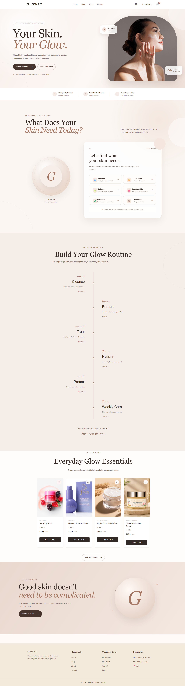
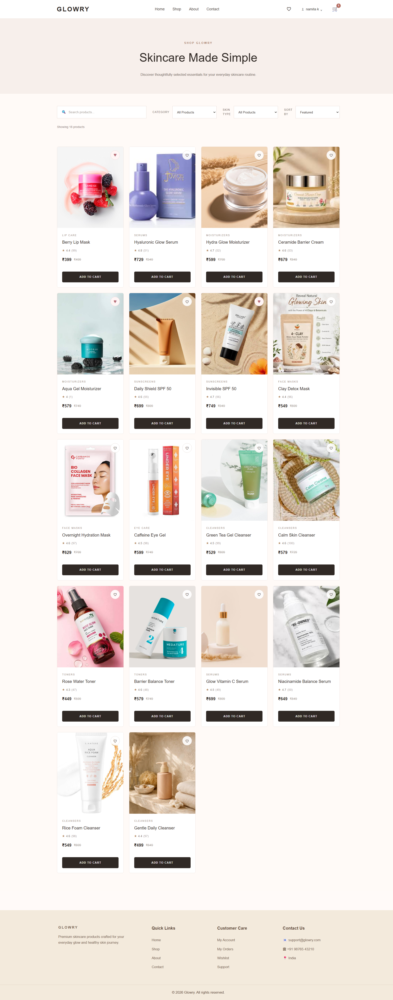
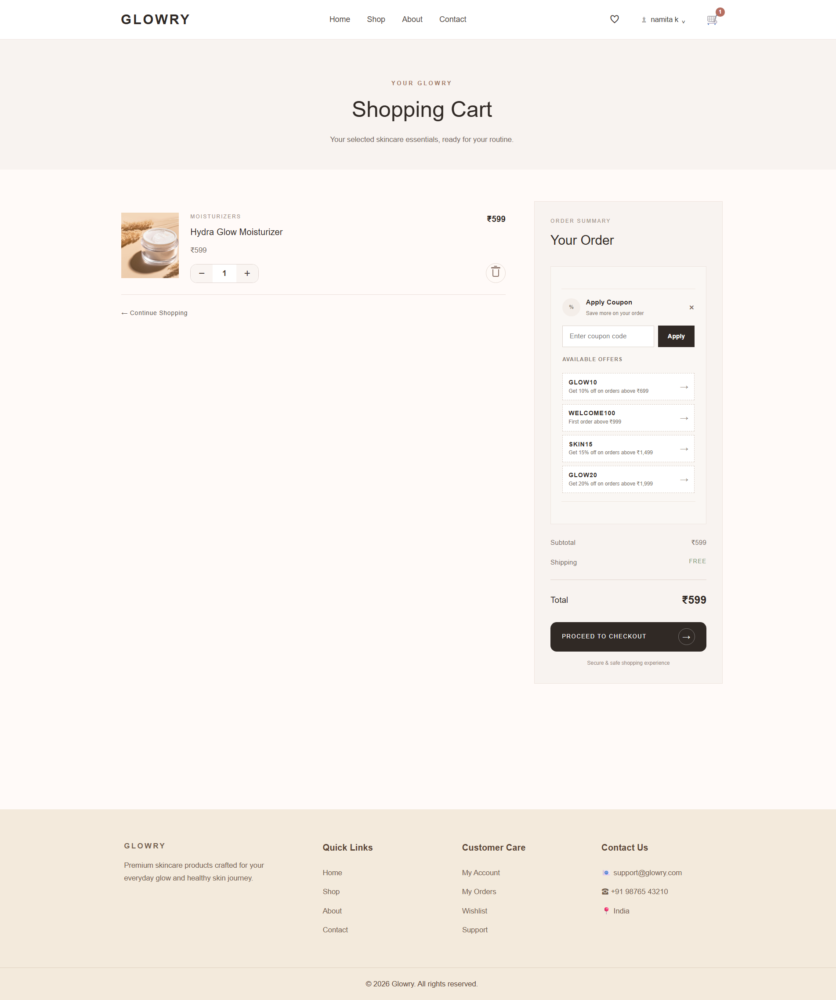
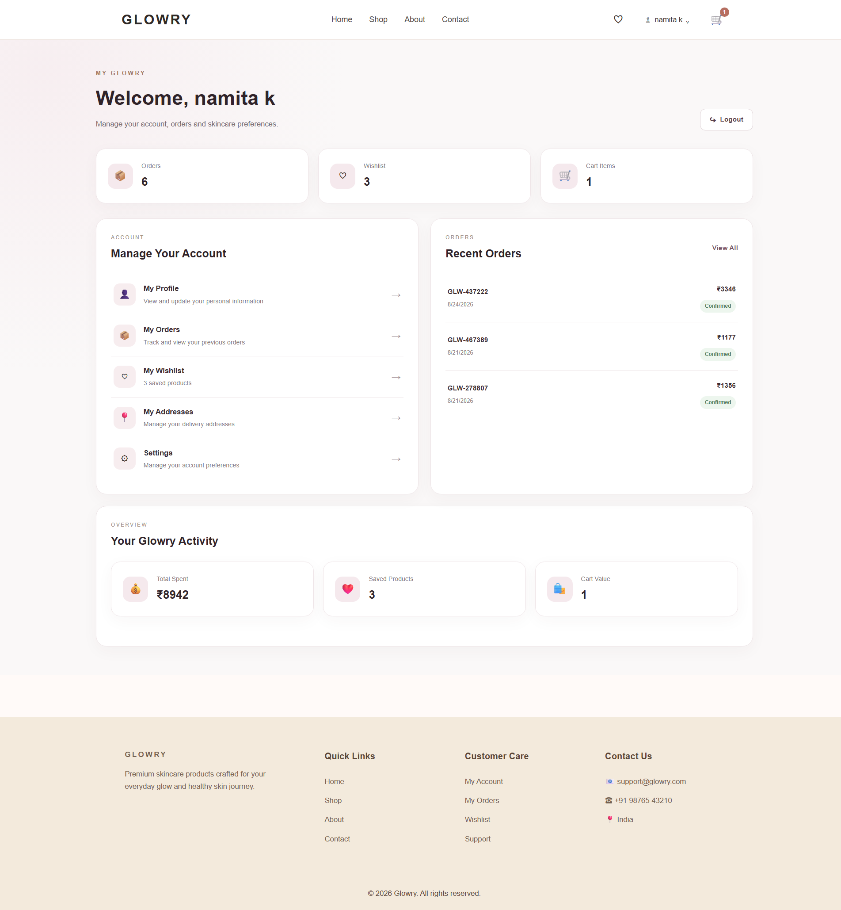
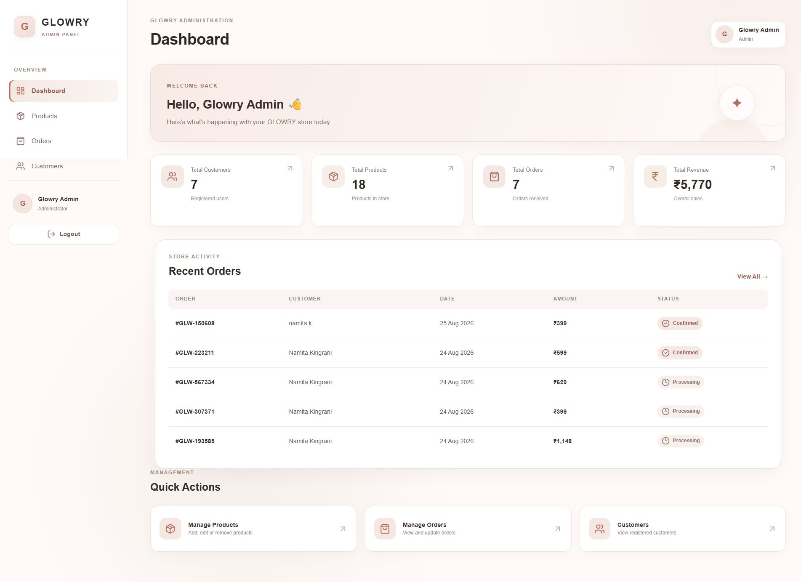
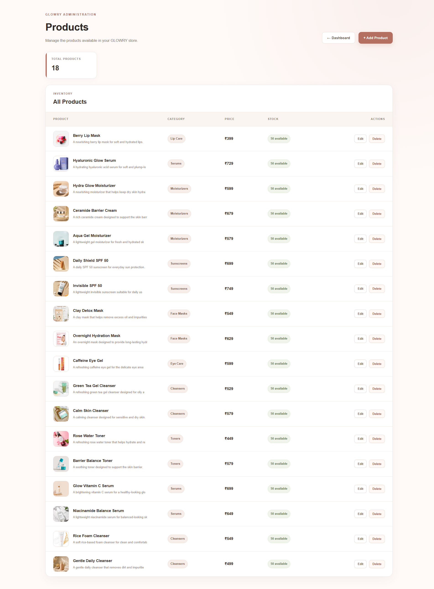

# GLOWRY — Skincare E-Commerce Website

A modern full-stack skincare e-commerce website built with the **MERN stack**. GLOWRY provides a complete online skincare shopping experience with product browsing, search and filtering, wishlist, cart, checkout, order tracking, user accounts, and a dedicated admin panel.

## ✨ Project Overview

GLOWRY is designed to make everyday skincare shopping simple, organized, and user-friendly.

The application includes two main experiences:

* **Customer Website** — Browse skincare products, manage wishlist and cart, place orders, track orders, and manage account settings.
* **Admin Panel** — Manage products, customers, orders, and store activity through a dedicated dashboard.

---

## 🚀 Features

### 👤 User Features

* User registration and login
* Secure password hashing with bcrypt
* JWT-based authentication
* Forgot password and reset password functionality
* User profile management
* Account settings
* Change password
* Address management
* Wishlist management
* Shopping cart
* Product search
* Product filtering and sorting
* Product details
* Product reviews and ratings
* Checkout
* Cash on Delivery and online payment options
* Order placement
* My Orders
* Order tracking
* Order status updates
* Email notifications
* Responsive skincare-focused UI

### 🛠️ Admin Features

* Separate admin authentication
* Admin dashboard
* Customer management
* Product management
* Add products
* Edit products
* Delete products
* Order management
* View customer orders
* Update order status
* Revenue overview
* Total customers statistics
* Total products statistics
* Total orders statistics
* Recent orders
* Quick management actions

---

## 🖥️ Screenshots

### 🏠 Home Page

The GLOWRY homepage introduces the brand, skincare routine, skin needs section, and featured products.



---

### 🛍️ Shop / Products

Customers can browse skincare products with search, filtering, sorting, categories, pricing, and product cards.



---

### 🧴 Product Details

The product details page provides detailed product information and allows users to interact with the product before adding it to the cart or wishlist.


---

### 🛒 Shopping Cart

Users can review selected products, update quantities, remove products, and proceed toward checkout.



---

### 👤 User Dashboard

The user dashboard provides access to profile information, orders, wishlist, addresses, order tracking, and account settings.



---

### 📊 Admin Dashboard

The admin dashboard provides an overview of store activity including customers, products, orders, revenue, and recent orders.



---

### 📦 Admin Product Management

Administrators can add, edit, and remove products from the store through the product management panel.



---

## 🧑‍💻 Tech Stack

### Frontend

* React.js
* Vite
* React Router
* Axios
* JavaScript
* HTML5
* CSS3
* Lucide React

### Backend

* Node.js
* Express.js
* MongoDB
* Mongoose
* JWT
* bcryptjs
* Nodemailer

### Development Tools

* Git
* GitHub
* MongoDB Compass
* VS Code

---

## 📁 Project Structure


glowry-skincare-ecommerce/
│
├── backend/
│   ├── config/
│   ├── controllers/
│   ├── middleware/
│   ├── models/
│   ├── public/
│   │   └── images/
│   ├── routes/
│   ├── utils/
│   ├── .env
│   ├── .gitignore
│   ├── package.json
│   ├── seedProducts.js
│   └── server.js
│
├── frontend/
│   ├── public/
│   ├── src/
│   │   ├── assets/
│   │   ├── components/
│   │   ├── context/
│   │   ├── data/
│   │   └── pages/
│   ├── package.json
│   └── vite.config.js
│
├── screenshots/
│   ├── home.png
│   ├── shop.png
│   ├── product-details.png
│   ├── cart.png
│   ├── user_dashboard.png
│   ├── admin_dashboard.png
│   └── admin_products.png
│
└── README.md


---

## ⚙️ Getting Started

### 1. Clone the Repository

```bash
git clone https://github.com/Namitaa2002/glowry-skincare-ecommerce.git
```

```bash
cd glowry-skincare-ecommerce
```

### 2. Install Frontend Dependencies

```bash
cd frontend
npm install
```

### 3. Install Backend Dependencies

Open another terminal:

```bash
cd backend
npm install
```

---

## 🔐 Environment Variables

Create a `.env` file inside the `backend` folder.

Example:

```env
PORT=5000
MONGO_URI=your_mongodb_connection_string
JWT_SECRET=your_jwt_secret

EMAIL_USER=your_email
EMAIL_PASS=your_email_password
```

**Do not commit the actual `.env` file to GitHub.**

---

## ▶️ Run the Project

### Start Backend

From the `backend` folder:

```bash
node server.js
```

The backend runs on:

```text
http://localhost:5000
```

### Start Frontend

From the `frontend` folder:

```bash
npm run dev
```

The frontend runs on the Vite development server, usually:

```text
http://localhost:5173
```

---

## 🔑 Application Routes

### Customer

```text
/
 /products
 /products/:id
 /cart
 /wishlist
 /checkout
 /orders
 /track-order
 /profile
 /settings
```

### Admin

```text
/admin/login
/admin
/admin/products
/admin/orders
/admin/users
```

---

## 🔒 Authentication & Security

The application includes:

* JWT authentication
* Password hashing using bcryptjs
* Protected user routes
* Protected admin routes
* Role-based admin access
* Secure password reset flow
* Environment variables for sensitive configuration

---

## 🛒 E-Commerce Flow

```text
Browse Products
      ↓
View Product Details
      ↓
Add to Wishlist / Cart
      ↓
Review Cart
      ↓
Checkout
      ↓
Place Order
      ↓
My Orders
      ↓
Track Order
```

---

## 🛠️ Admin Flow

```text
Admin Login
     ↓
Admin Dashboard
     ↓
Manage Products
     ↓
Manage Orders
     ↓
Manage Customers
     ↓
Update Order Status
```

---

## 📌 Future Improvements

Some possible future improvements include:

* Online payment gateway integration
* Product recommendation system
* Advanced admin analytics
* Inventory management
* Product stock alerts
* Customer notifications
* More advanced skincare personalization
* Deployment with a production database and hosting

---

## 🎯 Learning Outcomes

This project helped demonstrate practical implementation of:

* React component-based development
* React Router
* React state management and Context API
* REST API integration
* Axios
* Node.js and Express.js
* MongoDB and Mongoose
* CRUD operations
* Authentication and authorization
* JWT
* Password hashing
* Admin role management
* Cart and wishlist functionality
* Order management
* Git and GitHub
* Full-stack application structure

---

## 👩‍💻 Author

**Namita Kingrani**

MCA Graduate | Aspiring Software Developer

GitHub:
https://github.com/Namitaa2002

---

## ⭐ Project

**GLOWRY — Skincare E-Commerce Website**

A full-stack MERN project created to demonstrate practical frontend, backend, database, authentication, e-commerce, and admin-panel development.
