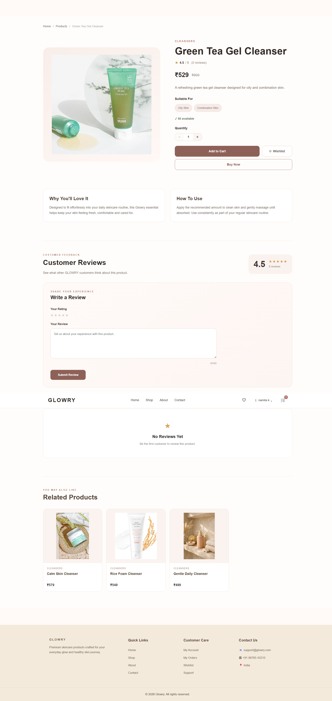

# ✨ GLOWRY — Skincare E-Commerce Website

**GLOWRY** is a full-stack skincare e-commerce web application built using the **MERN Stack**. It provides a modern shopping experience for customers along with a dedicated admin panel for managing products, customers, and orders.

The project focuses on clean UI, responsive design, authentication, REST APIs, MongoDB integration, cart and wishlist functionality, and complete order management.

---

## 🌸 Project Overview

GLOWRY is designed as a complete skincare shopping platform where users can:

* Explore skincare products
* Search, filter, and sort products
* View detailed product information
* Add products to cart and wishlist
* Manage their profile and addresses
* Place and track orders
* Manage account preferences
* Review products

The application also includes an **Admin Dashboard** for store management.

---

## 🚀 Key Features

### 🛍️ Customer Features

* Modern responsive skincare storefront
* Product search
* Category filtering
* Product sorting
* Product details
* Wishlist
* Shopping cart
* Cart quantity management
* Checkout
* Order placement
* Order history
* Order tracking
* User profile
* Address management
* Account settings
* Change password
* Forgot password
* Password reset
* Product reviews
* Contact form

### 👑 Admin Features

* Secure admin authentication
* Admin dashboard
* Store statistics
* Customer management
* Product management
* Add products
* Edit products
* Delete products
* Order management
* Update order status
* Recent orders
* Revenue overview

---

## 🛠️ Tech Stack

### Frontend

| Technology   | Purpose                           |
| ------------ | --------------------------------- |
| React.js     | User interface                    |
| Vite         | Frontend development & build tool |
| React Router | Page navigation                   |
| Axios        | API communication                 |
| Lucide React | Icons                             |
| CSS          | Styling & responsive UI           |

### Backend

| Technology | Purpose             |
| ---------- | ------------------- |
| Node.js    | Backend runtime     |
| Express.js | REST API            |
| MongoDB    | Database            |
| Mongoose   | MongoDB ODM         |
| JWT        | Authentication      |
| bcrypt.js  | Password hashing    |
| Nodemailer | Email functionality |

---

## 📁 Project Structure

```text
glowry-skincare-ecommerce/
│
├── frontend/
│   ├── src/
│   │   ├── assets/
│   │   ├── components/
│   │   ├── context/
│   │   ├── data/
│   │   └── pages/
│   └── package.json
│
├── backend/
│   ├── config/
│   ├── controllers/
│   ├── middleware/
│   ├── models/
│   ├── routes/
│   ├── utils/
│   ├── public/
│   ├── seedProducts.js
│   ├── server.js
│   └── package.json
│
├── screenshots/
│   ├── home.png
│   ├── shop.png
│   ├── product-details.png
│   ├── cart.png
│   ├── user_dashboard.png
│   ├── admin_dashboard.png
│   └── admin_products.png
│
└── README.md
```

---

## 📸 Screenshots

### 🏠 Home Page


### 🛍️ Shop


### 🧴 Product Details



### 🛒 Shopping Cart


### 👤 User Dashboard


### 👑 Admin Dashboard


### 📦 Admin Product Management


---

## 🔐 Authentication & Security

The application uses JWT-based authentication and role-based access control.

### User Authentication

* User registration
* Secure password hashing using bcrypt.js
* User login
* JWT token generation
* Protected user routes
* Password change
* Password reset

### Admin Authentication

* Separate admin login
* JWT-based admin authentication
* Admin-only protected routes
* Role-based authorization

Sensitive credentials and environment variables are excluded from the repository.

---

## 🛒 Shopping & Order Flow

The customer shopping flow includes:

```text
Browse Products
      ↓
View Product Details
      ↓
Add to Cart
      ↓
Review Cart
      ↓
Checkout
      ↓
Place Order
      ↓
Order Confirmation
      ↓
Track Order
```

### Order Status

Orders can move through the following statuses:

* Processing
* Confirmed
* Shipped
* Delivered
* Cancelled

---

## 👑 Admin Dashboard

The admin dashboard provides an overview of the store through:

* Total Customers
* Total Products
* Total Orders
* Total Revenue
* Recent Orders

Administrators can also manage:

* Products
* Orders
* Customers

---

## ⚙️ Getting Started

### Prerequisites

Make sure you have installed:

* Node.js
* npm
* MongoDB

---

### 1. Clone the Repository

```bash
git clone https://github.com/Namitaa2002/glowry-skincare-ecommerce.git
cd glowry-skincare-ecommerce
```

---

### 2. Backend Setup

Navigate to the backend:

```bash
cd backend
```

Install dependencies:

```bash
npm install
```

Create a `.env` file inside the `backend` folder:

```env
PORT=5000
MONGO_URI=your_mongodb_connection_string
JWT_SECRET=your_jwt_secret

EMAIL_USER=your_email
EMAIL_PASS=your_email_app_password
```

Start the backend server:

```bash
npm start
```

Backend:

```text
http://localhost:5000
```

---

### 3. Frontend Setup

Open a new terminal and navigate to the frontend:

```bash
cd frontend
```

Install dependencies:

```bash
npm install
```

Start the development server:

```bash
npm run dev
```

Frontend:

```text
http://localhost:5173
```

---

## 🔗 Application Routes

### Customer

| Route           | Description      |
| --------------- | ---------------- |
| `/`             | Home             |
| `/products`     | Shop             |
| `/products/:id` | Product Details  |
| `/cart`         | Shopping Cart    |
| `/wishlist`     | Wishlist         |
| `/checkout`     | Checkout         |
| `/orders`       | My Orders        |
| `/track-order`  | Track Order      |
| `/profile`      | User Profile     |
| `/settings`     | Account Settings |

### Admin

| Route              | Description         |
| ------------------ | ------------------- |
| `/admin/login`     | Admin Login         |
| `/admin/dashboard` | Admin Dashboard     |
| `/admin/products`  | Product Management  |
| `/admin/orders`    | Order Management    |
| `/admin/users`     | Customer Management |

---

## 🔌 Backend API Modules

The backend is organized into separate REST API route modules for:

* Authentication
* Products
* Cart
* Wishlist
* Orders
* Addresses
* Reviews
* Contact
* Admin Products
* Admin Orders
* Admin Users

This structure keeps the backend modular and easier to maintain.

---

## 📧 Email Functionality

GLOWRY includes email functionality using **Nodemailer**.

Email functionality is used for account-related communication such as:

* Welcome email after registration
* Password reset emails

---

## 🎯 Learning Objectives

This project was developed to gain practical experience with:

* MERN stack development
* React component architecture
* REST API development
* MongoDB database operations
* Authentication and authorization
* CRUD operations
* API integration using Axios
* State management
* Protected routes
* Admin dashboards
* E-commerce workflows
* Responsive UI development

---

## 🔮 Future Improvements

Possible future enhancements include:

* Online payment gateway integration
* Product recommendation system
* Advanced skincare quiz
* Inventory management
* Sales analytics
* Cloud image storage
* Deployment with production database
* Automated email notifications
* Advanced admin reporting

---

## 👩‍💻 Author

### Namita Kingrani

**MCA Graduate | Aspiring Software Developer**

Built as a full-stack MERN project to demonstrate practical development skills across frontend, backend, database, authentication, and e-commerce functionality.

---

## ⭐ Project

If you find this project useful or interesting, consider giving the repository a ⭐ on GitHub.

**GLOWRY — Your Skin. Your Glow.**
